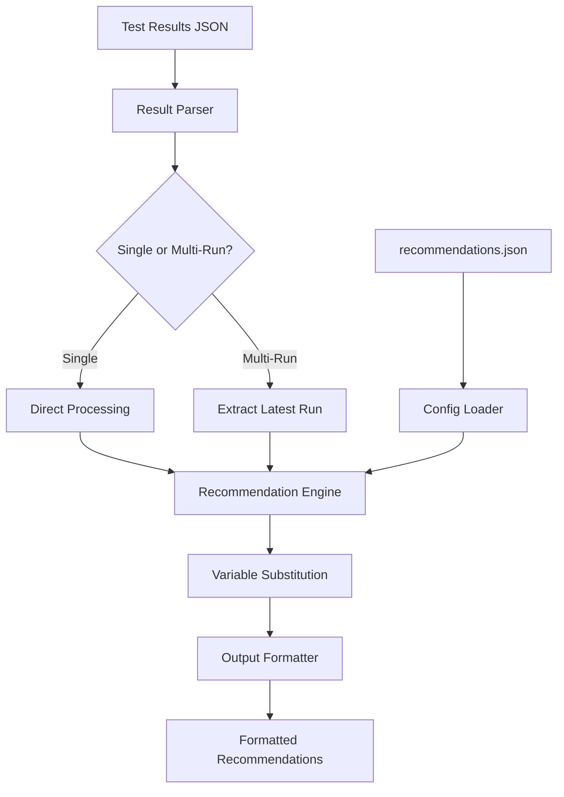

# HPC Diagnostic Recommender System

## Overview

The OCI DR HPC v2 recommender module is an intelligent diagnostic analysis system that transforms raw test results into actionable recommendations for fixing HPC environment issues. It provides structured fault codes, detailed remediation steps, and multi-format output to help administrators quickly diagnose and resolve problems.

## Architecture

### Core Components

```
Recommender System
├── Result Parser          # Parses JSON test results
├── Configuration Loader   # Loads recommendation templates 
├── Recommendation Engine  # Matches tests to recommendations
├── Variable Substitution  # Dynamic content generation
└── Multi-Format Output    # JSON, table, friendly formats
```

### Data Flow



## Input Processing

### Supported Input Formats

The recommender accepts two JSON format types:

#### 1. Single Test Run Format
```json
{
  "gpu_count_check": [
    {
      "status": "FAIL",
      "gpu_count": 6,
      "timestamp_utc": "2024-01-01T10:00:00Z"
    }
  ],
  "pcie_error_check": [
    {
      "status": "PASS",
      "timestamp_utc": "2024-01-01T10:00:00Z"
    }
  ]
}
```

#### 2. Multi-Run Append Format
```json
{
  "test_runs": [
    {
      "run_id": "run_1704067200",
      "timestamp": "2024-01-01T10:00:00Z",
      "test_results": {
        "gpu_count_check": [
          {
            "status": "FAIL",
            "gpu_count": 6,
            "timestamp_utc": "2024-01-01T10:00:00Z"
          }
        ]
      }
    }
  ]
}
```

### Result Parsing Logic

The system automatically detects the format and processes accordingly:

```go
// Simplified parsing logic
func parseResults(data []byte) (HostResults, error) {
    // Try multi-run format first
    if multiRun := tryParseMultiRun(data); multiRun != nil {
        return extractLatestRun(multiRun), nil
    }
    
    // Fall back to single format
    return parseSingleRun(data), nil
}
```

## Configuration System

### Configuration File Hierarchy

The recommender searches for `recommendations.json` in this order:

1. **Current Directory**: `./recommendations.json` (highest priority override)
2. **User Config**: `~/.config/oci-dr-hpc/recommendations.json`
3. **System Config**: `/etc/oci-dr-hpc/recommendations.json`
4. **System Data**: `/usr/share/oci-dr-hpc/recommendations.json`
5. **Legacy Location**: `/etc/oci-dr-hpc-recommendations.json`
6. **Development**: `configs/recommendations.json`

### Configuration Structure

```json
{
  "recommendations": {
    "test_name": {
      "fail": {
        "type": "critical|warning|info",
        "fault_code": "HPCGPU-XXXX-XXXX",
        "issue": "Description of the problem",
        "suggestion": "How to fix it",
        "commands": ["command1", "command2"],
        "references": ["url1", "url2"]
      },
      "pass": {
        "type": "info",
        "issue": "Success message",
        "suggestion": "What this means"
      }
    }
  },
  "summary_templates": {
    "no_issues": "Message when all tests pass",
    "has_issues": "Message with {variable} substitution"
  }
}
```

### Fault Code System

Fault codes follow the pattern: `HPCGPU-XXXX-XXXX`

- **HPCGPU**: Product identifier for HPC GPU diagnostics
- **First XXXX**: Test category (0001=GPU, 0002=PCIe, 0003=RDMA)
- **Second XXXX**: Specific error type (0001=count mismatch, etc.)

#### Current Fault Codes

| Fault Code | Test | Description |
|------------|------|-------------|
| `HPCGPU-0001-0001` | gpu_count_check | GPU count mismatch |
| `HPCGPU-0002-0001` | pcie_error_check | PCIe errors detected |
| `HPCGPU-0003-0001` | rdma_nics_count | RDMA NIC count mismatch |

## Recommendation Engine

### Matching Algorithm

```go
func (config *RecommendationConfig) GetRecommendation(testName, status string, testResult TestResult) *Recommendation {
    // 1. Find test configuration
    testConfig, exists := config.Recommendations[testName]
    if !exists {
        return nil // No config for this test
    }
    
    // 2. Select template based on status
    var template *RecommendationTemplate
    switch strings.ToUpper(status) {
    case "FAIL":
        template = testConfig.Fail
    case "PASS":
        template = testConfig.Pass
    default:
        return nil // Unknown status
    }
    
    // 3. Generate recommendation with variable substitution
    return createRecommendation(template, testName, testResult)
}
```

### Variable Substitution

The system supports dynamic content through variable substitution:

#### Available Variables

| Variable | Source | Description |
|----------|--------|-------------|
| `{gpu_count}` | TestResult.GPUCount | Number of GPUs detected |
| `{num_rdma_nics}` | TestResult.NumRDMANics | Number of RDMA NICs detected |
| `{total_issues}` | RecommendationReport | Total issues found (summary only) |
| `{critical_count}` | RecommendationReport | Critical issues count (summary only) |
| `{warning_count}` | RecommendationReport | Warning issues count (summary only) |

#### Example Usage

**Template:**
```json
{
  "issue": "GPU count mismatch detected. Expected count not met (found: {gpu_count})",
  "suggestion": "Verify GPU hardware installation for {gpu_count} detected GPUs"
}
```

**Output:**
```
Issue: GPU count mismatch detected. Expected count not met (found: 6)
Suggestion: Verify GPU hardware installation for 6 detected GPUs
```

## Output Formats

### 1. JSON Format

Structured output for programmatic consumption:

```json
{
  "summary": "Found 1 issue(s) requiring attention: 1 critical, 0 warning",
  "total_issues": 1,
  "critical_issues": 1,
  "warning_issues": 0,
  "info_issues": 0,
  "recommendations": [
    {
      "type": "critical",
      "test_name": "gpu_count_check",
      "fault_code": "HPCGPU-0001-0001",
      "issue": "GPU count mismatch detected. Expected count not met (found: 6)",
      "suggestion": "Verify GPU hardware installation and driver status",
      "commands": ["nvidia-smi", "lspci | grep -i nvidia"],
      "references": ["https://docs.nvidia.com/..."]
    }
  ],
  "generated_at": "2025-07-07T23:00:00Z"
}
```

### 2. Table Format

Structured table for reports and documentation:

```
┌─────────────────────────────────────────────────────────────────┐
│                    HPC DIAGNOSTIC RECOMMENDATIONS              │
├─────────────────────────────────────────────────────────────────┤
│ SUMMARY                                                         │
├─────────────────────────────────────────────────────────────────┤
│ Total Issues: 1                                                 │
│ Critical: 1                                                     │
│ Warning: 0                                                      │
│ Info: 0                                                         │
├─────────────────────────────────────────────────────────────────┤
│ RECOMMENDATIONS                                                 │
├─────────────────────────────────────────────────────────────────┤
│ 1. [CRITICAL] gpu_count_check                                   │
│    Fault Code: HPCGPU-0001-0001                                │
│    Issue: GPU count mismatch detected. Expected count not met...│
│    Suggestion: Verify GPU hardware installation and driver...  │
│    Command: nvidia-smi                                         │
├─────────────────────────────────────────────────────────────────┤
│ Generated at: 2025-07-07T23:00:00Z                             │
└─────────────────────────────────────────────────────────────────┘
```

### 3. Friendly Format

Human-readable format with emojis and clear structure:

```
======================================================================
🔍 HPC DIAGNOSTIC RECOMMENDATIONS
======================================================================

📊 SUMMARY: ⚠️ Found 1 issue(s) requiring attention: 1 critical, 0 warning
   • Total Issues: 1
   • Critical: 1
   • Warning: 0
   • Info: 0

----------------------------------------------------------------------
📋 DETAILED RECOMMENDATIONS
----------------------------------------------------------------------

🚨 1. CRITICAL [gpu_count_check]
   Fault Code: HPCGPU-0001-0001
   Issue: GPU count mismatch detected. Expected count not met (found: 6)
   Suggestion: Verify GPU hardware installation and driver status
   Commands to run:
     $ nvidia-smi
     $ lspci | grep -i nvidia
     $ dmesg | grep -i nvidia
   References:
     - https://docs.nvidia.com/datacenter/tesla/tesla-installation-notes/

======================================================================
Generated at: 2025-07-07T23:00:00Z
======================================================================
```

## Fallback System

### When Fallback Triggers

The system automatically falls back to built-in recommendations when:

1. Configuration file cannot be found in any search location
2. Configuration file exists but contains invalid JSON
3. Configuration file is readable but missing required test configurations

### Fallback Behavior

```go
func generateFallbackRecommendations(results HostResults) RecommendationReport {
    logger.Info("Using fallback recommendations due to config load failure")
    
    // Generate basic recommendations with hardcoded templates
    recommendations := []Recommendation{}
    
    // GPU failures
    for _, gpu := range results.GPUCountCheck {
        if gpu.Status == "FAIL" {
            rec := Recommendation{
                Type:       "critical",
                TestName:   "gpu_count_check",
                Issue:      fmt.Sprintf("GPU count mismatch detected (found: %d)", gpu.GPUCount),
                Suggestion: "Verify GPU hardware installation and driver status",
                Commands:   []string{"nvidia-smi", "lspci | grep -i nvidia"},
            }
            recommendations = append(recommendations, rec)
        }
    }
    
    // Include "(fallback mode)" in summary
    summary := fmt.Sprintf("Found %d issue(s) requiring attention (fallback mode)", len(recommendations))
    
    return RecommendationReport{
        Summary: summary,
        Recommendations: recommendations,
        // ... other fields
    }
}
```

### Fallback Indicators

- Summary includes `(fallback mode)` text
- Simplified command lists
- No fault codes
- Basic issue descriptions
- Limited reference URLs

## Usage Examples

### Basic Usage

```bash
# Analyze test results
oci-dr-hpc-v2 recommender -r results.json

# Specify output format
oci-dr-hpc-v2 recommender -r results.json --output friendly
oci-dr-hpc-v2 recommender -r results.json --output json
oci-dr-hpc-v2 recommender -r results.json --output table
```

### Debug Configuration

```bash
# See where configuration is loaded from
oci-dr-hpc-v2 recommender -r results.json --verbose
# Output: INFO: Loading recommendation config from: /usr/share/oci-dr-hpc/recommendations.json

# Debug configuration search paths
export OCI_DR_HPC_LOGGING_LEVEL="debug"
oci-dr-hpc-v2 recommender -r results.json
# Shows all 6 search locations and their status
```

### Custom Configuration

```bash
# Use local override
cp configs/recommendations.json ./recommendations.json
# Edit ./recommendations.json with custom recommendations
oci-dr-hpc-v2 recommender -r results.json

# Use user-specific configuration
mkdir -p ~/.config/oci-dr-hpc
cp configs/recommendations.json ~/.config/oci-dr-hpc/
oci-dr-hpc-v2 recommender -r results.json
```

## Integration Patterns

### CI/CD Integration

```yaml
# Example GitHub Actions workflow
- name: Run HPC Diagnostics
  run: |
    oci-dr-hpc-v2 level1 --output json --output-file results.json
    
- name: Generate Recommendations
  run: |
    oci-dr-hpc-v2 recommender -r results.json --output json > recommendations.json
    
- name: Upload Artifacts
  uses: actions/upload-artifact@v2
  with:
    name: hpc-diagnostics
    path: |
      results.json
      recommendations.json
```

### Monitoring Integration

```bash
#!/bin/bash
# monitoring-integration.sh

# Run diagnostics
oci-dr-hpc-v2 level1 --output json --output-file /tmp/results.json

# Generate recommendations
RECOMMENDATIONS=$(oci-dr-hpc-v2 recommender -r /tmp/results.json --output json)

# Extract metrics
CRITICAL_COUNT=$(echo "$RECOMMENDATIONS" | jq '.critical_issues')
WARNING_COUNT=$(echo "$RECOMMENDATIONS" | jq '.warning_issues')

# Send to monitoring system
curl -X POST "http://monitoring-system/metrics" \
  -H "Content-Type: application/json" \
  -d "{
    \"critical_issues\": $CRITICAL_COUNT,
    \"warning_issues\": $WARNING_COUNT,
    \"timestamp\": \"$(date -u +%Y-%m-%dT%H:%M:%SZ)\"
  }"
```

### Alert Integration

```bash
#!/bin/bash
# alert-integration.sh

RECOMMENDATIONS=$(oci-dr-hpc-v2 recommender -r results.json --output json)
CRITICAL_COUNT=$(echo "$RECOMMENDATIONS" | jq '.critical_issues')

if [ "$CRITICAL_COUNT" -gt 0 ]; then
    # Extract fault codes for alert context
    FAULT_CODES=$(echo "$RECOMMENDATIONS" | jq -r '.recommendations[] | select(.type=="critical") | .fault_code' | tr '\n' ',' | sed 's/,$//')
    
    # Send alert
    curl -X POST "https://alerts.example.com/webhook" \
      -H "Content-Type: application/json" \
      -d "{
        \"alert\": \"HPC Critical Issues Detected\",
        \"fault_codes\": \"$FAULT_CODES\",
        \"critical_count\": $CRITICAL_COUNT,
        \"details\": $(echo "$RECOMMENDATIONS" | jq -c '.recommendations[] | select(.type=="critical")')
      }"
fi
```

## Extending the System

### Adding New Test Types

1. **Update Configuration Schema**:
```json
{
  "recommendations": {
    "your_new_test": {
      "fail": {
        "type": "warning",
        "fault_code": "HPCGPU-0004-0001",
        "issue": "Your test failed with {custom_variable}",
        "suggestion": "How to fix it",
        "commands": ["diagnostic-command"],
        "references": ["https://docs.example.com/"]
      }
    }
  }
}
```

2. **Add Variable Substitution** (if needed):
```go
// In applyVariableSubstitution function
result = strings.ReplaceAll(result, "{custom_variable}", fmt.Sprintf("%s", testResult.CustomField))
```

3. **Update Test Processing**:
```go
// In generateRecommendations function
testMappings := []struct {
    testName string
    results  []TestResult
}{
    {"gpu_count_check", results.GPUCountCheck},
    {"pcie_error_check", results.PCIeErrorCheck},
    {"rdma_nics_count", results.RDMANicsCount},
    {"your_new_test", results.YourNewTest}, // Add here
}
```

### Custom Output Formats

```go
// Add to recommender.go
func formatRecommendationsCustom(report RecommendationReport) (string, error) {
    // Your custom formatting logic
    return customOutput, nil
}

// Add to AnalyzeResults function
case "custom":
    output, err = formatRecommendationsCustom(report)
```

## Best Practices

### Configuration Management

1. **Version Control**: Keep recommendation configurations in version control
2. **Testing**: Validate JSON syntax and test with sample data before deployment
3. **Documentation**: Document custom fault codes and their meanings
4. **Backup**: Maintain backups of working configurations

### Error Handling

1. **Graceful Degradation**: Always provide fallback recommendations
2. **Clear Logging**: Log configuration load paths and failures
3. **Validation**: Validate input JSON format before processing
4. **Status Mapping**: Handle unknown test statuses gracefully

### Performance Considerations

1. **Configuration Caching**: Configuration is loaded once per invocation
2. **Variable Substitution**: Performed on-demand to minimize memory usage
3. **Output Buffering**: Large outputs are built incrementally
4. **File I/O**: Configuration search stops at first successful load

## Troubleshooting

### Common Issues

#### Configuration Not Loading
```bash
# Debug search paths
export OCI_DR_HPC_LOGGING_LEVEL="debug"
oci-dr-hpc-v2 recommender -r results.json
```

#### Invalid JSON Configuration
```bash
# Validate syntax
python -m json.tool /usr/share/oci-dr-hpc/recommendations.json
```

#### Missing Recommendations
- Verify test name matches exactly (case-sensitive)
- Ensure both "fail" and "pass" sections exist
- Check test results use correct status values ("PASS", "FAIL")

#### Variable Substitution Not Working
- Verify variable names are correct and case-sensitive
- Ensure test results contain expected fields
- Variables must be enclosed in curly braces: `{variable_name}`

### Debug Commands

```bash
# Show configuration loading path
oci-dr-hpc-v2 recommender -r results.json --verbose

# Test with sample data
echo '{"gpu_count_check":[{"status":"FAIL","gpu_count":6,"timestamp_utc":"2024-01-01T10:00:00Z"}]}' > test.json
oci-dr-hpc-v2 recommender -r test.json --output friendly

# Validate configuration file
python -c "import json; json.load(open('/usr/share/oci-dr-hpc/recommendations.json'))"
```

## Summary

The HPC Diagnostic Recommender System provides:

- **Intelligent Analysis**: Transforms raw test data into actionable insights
- **Fault Code System**: Structured error classification for tracking and automation
- **Multi-Format Output**: JSON, table, and friendly formats for different use cases
- **Flexible Configuration**: JSON-based templates with variable substitution
- **Robust Fallback**: Ensures recommendations are always available
- **Debug Visibility**: Clear logging for troubleshooting configuration issues
- **Integration Ready**: Designed for CI/CD, monitoring, and alerting systems

This system enables HPC administrators to quickly understand and resolve issues in their environments while providing structured data for automation and tracking purposes.